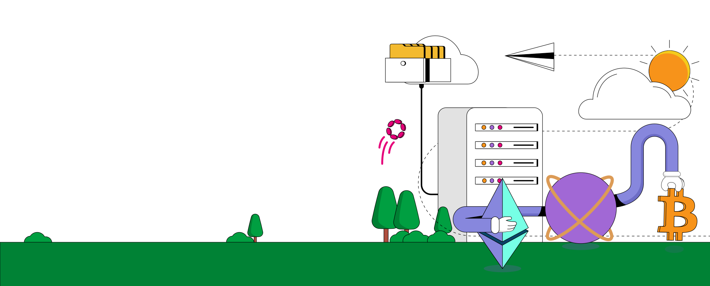
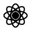
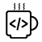
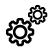

	<header class="section">
	 
		

			

				

					

						<h1 class="hero-heading">The Layer of Dojima Knowledge</h1>
						

						
 Welcome to the Dojima Network Documentation! As pioneers in the Web3 space, we're thrilled to guide you through the seamless world of crosschain connectivity.

						
Our documentation is crafted to empower you, whether you're developing innovative applications or diving into blockchain technology for the first time. Here, you'll find everything you need to harness the full potential of Dojima Network. Dive in, explore, and join us in shaping the future of a unified Web3 ecosystem. Your journey towards groundbreaking discoveries starts now!
						

						

						<a class="button-container" href="core/">
							<button class="getstarted-button">
							Get Started 
							</button>
						</a>
					

					

				

			

		

	</header>
	

	

	 

			

				

				
					<h3>Core</h3>
				

				
Unveiling Dojima Network's essence, highlighting the innovative infrastructure of Hermes and Dojima chains.

				

					<a class="div-card-button" href="core/what-is-dojima-network/">
							What is Dojima Network? 
					</a>
					<a class="div-card-button" href="core/architecture/hermeschain/">
						Hermes Chain 
					</a>
			   

    	   

    	

		 

			

				

				
					<h3>Developers</h3>
				

				
Your resource hub for seamless onboarding and support within our evolving ecosystem.

				

					<a class="div-card-button" href="developer/templates/omni_chain_ERC20/">
							Templates 
					</a>
					<a class="div-card-button" href="developer/faucet/">
						Faucet
					</a>
					

				 <a class="left-p ">Developer Dashboard</a>
				  
Coming Soon

				

			   

    	   

    	

	

	

	   

	           

				
					<h3>Tools</h3>
				

				
Explore our versatile tools section featuring a cross-chain wallet, innovative FAAS solution, and developer dashboard for seamless integration.

				<a class="middle-p" href="tools/wallet/">
				

				 
Dojima Wallet

			
				  </svg>
				  <!-- 
Live
 -->
				

				  
Dojima wallet lets you organise major layer 1 tokens in one place.

				</a>
				<a class="middle-p" href="tools/dojima-faas/">
				

				 
Dojima FAAS

				
				  <!-- 
Live
 -->
				

				  
Dojima FAAS offers blockchain services like transaction signing and history viewing.

				</a>
				<!-- <a class="last-p" href="tools/developer-dashboard/login/"> -->
				<!-- 

				 
Developer Dashboard

				 
				  
Coming Soon

				
 -->
				  <!-- 
Empower your development journey with our intuitive developer dashboard, offering insights, tools, and resources for efficient blockchain integration and application management.

				</a>		 -->
	    

	   

	

				
					<h3>Validator</h3>
				

				
Unlock the path to becoming a valued validator with our comprehensive documentation, empowering you to safeguard the integrity of our blockchain network.

				
	 

	

    

